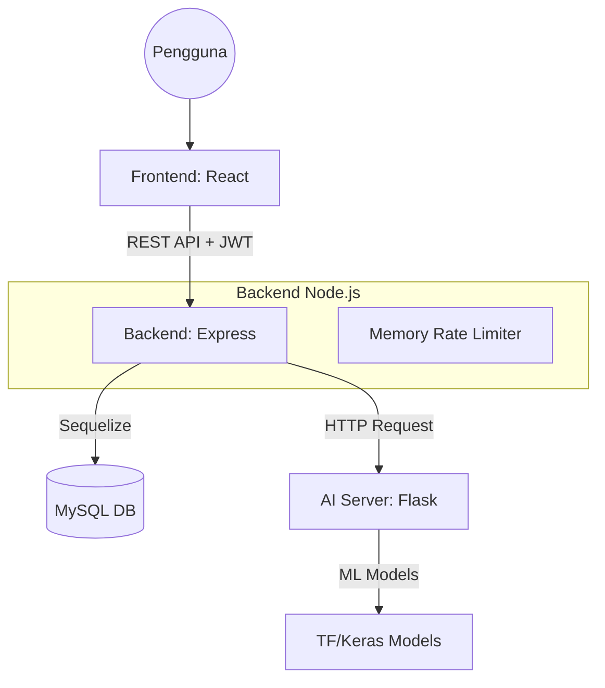
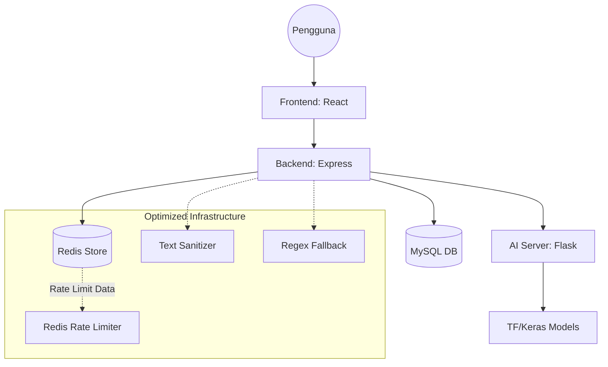

# Arsitektur Sistem FinZ

Dokumen ini menjelaskan arsitektur teknis FinZ saat ini dan rencana pengembangan masa depan sesuai dengan `planning_update.md`.

---

## 1. Arsitektur Saat Ini (Current State)

Saat ini FinZ menggunakan arsitektur **Three-Tier** dengan pemisahan antara logika bisnis backend dan kecerdasan buatan (Decoupled AI).

### A. Teknologi Utama
*   **Frontend**: React (Vite) + Context API untuk State Management.
*   **Backend API**: Node.js (Express) + Sequelize ORM (MySQL).
*   **AI Server**: Python (Flask) + TensorFlow/Keras.
*   **Database**: MySQL (Relational).

### B. Komunikasi & Alur Data
1.  **Request Flow**: Frontend mengirimkan request HTTP (REST) ke API Node.js dengan JWT di Header.
2.  **AI Orchestration**: Node.js bertindak sebagai orkestrator. Jika request memerlukan kecerdasan (seperti klasifikasi transaksi), Node.js melakukan pemanggilan internal ke AI Server (Flask) via HTTP.
3.  **Local Memory Storage**: State AI seperti `alert_store` saat ini masih bersifat in-memory di sisi Python (akan hilang jika server mati).

---

## 2. Diagram Arsitektur (Visualisasi)

### Versi Saat Ini (In-Memory Limiter)

### Versi Masa Depan (Redis + Optimized)

---

## 3. Detail Evolusi Arsitektur (Planning Update)

Berdasarkan `planning_update.md`, berikut adalah perubahan yang diimplementasikan:

### 1. Sistem Rate Limiting
*   **Sekarang**: Menggunakan `express-rate-limit` dengan *Memory Store*. Data hitungan hilang jika server restart.
*   **Planning**: Migrasi ke **Redis Store**. Angka pengaksesan user disimpan di Redis. Lebih tahan banting terhadap *traffic spikes* dan mendukung *horizontal scaling*.

### 2. Alur Prediksi Teks (Sanitasi & Fallback)
*   **Sekarang**: Backend langsung mengirimkan teks mentah dari user ke AI. Jika AI mati (503), sistem gagal.
*   **Planning**: 
    - **Sanitizer**: Backend membersihkan input (lowercase, no symbols) sebelum ke AI untuk akurasi tinggi.
    - **Graceful Fallback**: Jika AI tidak merespons, Backend menjalankan *logic* internal (Regex) agar kategori tetap terisi otomatis.

### 3. Skema Data (Recurring Transaction)
*   **Sekarang**: Semua transaksi dianggap dinamis.
*   **Planning**: Penambahan logika `is_recurring` pada komunikasi data. 
    - *Backend* menandai data. 
    - *AI Server* mengecualikan data tersebut dari algoritma *Anomaly Detection* agar tidak muncul peringatan "Bahaya" yang salah (False Positive).

### 4. Komunikasi Lintas Server
*   **Sekarang**: Synchronous HTTP calls.
*   **Planning**: Penambahan mekanisme *timeout* dan *error handling* yang lebih matang agar kegagalan sistem AI tidak menghentikan layanan inti keuangan pengguna.
