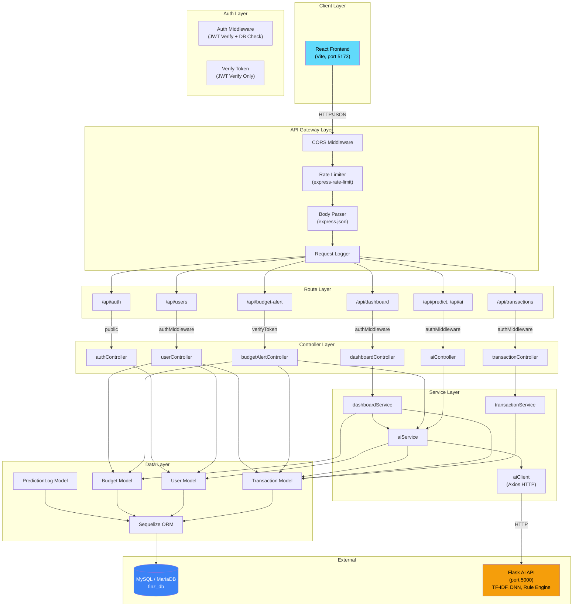
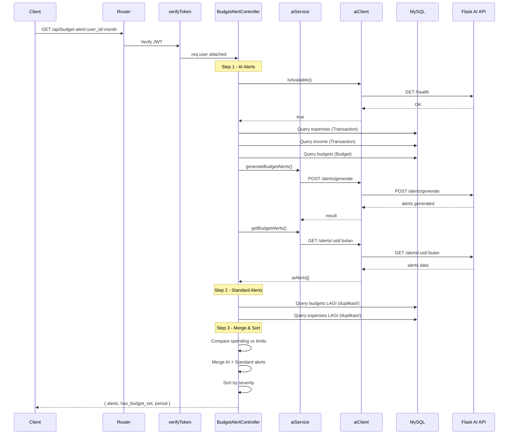
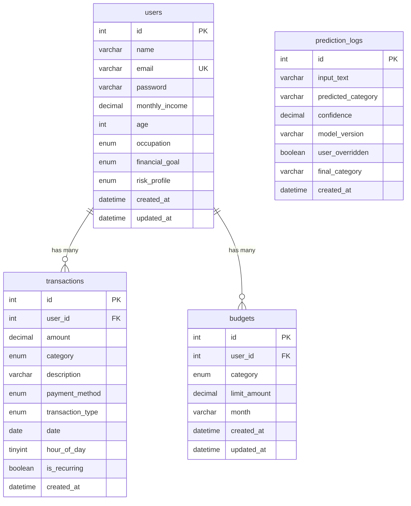

# 🏗️ Analisis Arsitektur Backend FinZ

**Project**: FinZ — AI-Powered Personal Financial Advisor  
**Stack**: Node.js + Express.js + Sequelize ORM + MySQL + Flask AI API  
**Tanggal Analisis**: 21 Mei 2026

---

## 1. Arsitektur yang Digunakan

### Pola: **Layered MVC + Service Layer**

Backend FinZ menggunakan arsitektur **berlapis (layered)** dengan pemisahan tanggung jawab:

```
Client (React) ──► Routes ──► Middleware ──► Controller ──► Service ──► Model/DB
                                                              │
                                                              ▼
                                                     Flask AI API (External)
```

| Layer | Direktori | Tanggung Jawab |
|-------|-----------|----------------|
| **Entry Point** | `server.js`, `app.js` | Bootstrap, DB connect, middleware registration |
| **Routes** | `src/routes/` | URL mapping, middleware chaining |
| **Middleware** | `src/middlewares/` | Auth (JWT), validation, logging, error handling |
| **Controller** | `src/controllers/` | Request parsing, response formatting |
| **Service** | `src/services/` | Business logic, AI integration |
| **Model** | `src/models/` | Sequelize ORM definitions, associations |
| **Config** | `src/config/` | Database connection config |

---

## 2. Flow Backend Saat Ini

### Authentication Flow
```
POST /api/auth/register → authController.register → User.create (bcrypt hook) → JWT token
POST /api/auth/login    → authController.login    → User.findOne + comparePassword → JWT token
GET  /api/auth/me       → authMiddleware → authController.me → User.findByPk
```

### Transaction Flow (CRUD)
```
Request → authMiddleware → validators → transactionController → transactionService → Transaction model
```

### AI Prediction Flow
```
POST /predict/balance  → aiService.predictBalance → aiClient.predictSaldo (Flask) → fallback (mock)
POST /predict/category → aiService.predictCategory → aiClient.predictKategori (Flask) → fallback (rule-based)
```

### Budget Alert Flow (Paling Kompleks)
```
GET /budget-alert/:user_id/:month
  1. Cek AI API availability
  2. Query transaksi expense bulan ini
  3. Query income bulan ini  
  4. Query budgets user
  5. Generate AI alerts via Flask API
  6. Fetch fresh AI alerts
  7. Query transaksi lagi untuk standard alerts (DUPLIKASI!)
  8. Compare spending vs budget limits
  9. Merge AI alerts + standard alerts
  10. Sort dan return
```

### Dashboard Flow
```
GET /api/dashboard → dashboardService.getDashboardSummary
  1. Query semua transaksi bulan ini
  2. Hitung total spending & income
  3. Group by kategori
  4. Fire-and-forget: generate AI budget alerts (background)
  5. Daily breakdown
  6. Monthly breakdown (6 bulan)
  7. Return summary
```

---

## 3. Identifikasi Pola Arsitektur

| Pola | Status | Keterangan |
|------|--------|------------|
| MVC | ✅ Diterapkan | Routes → Controller → Model |
| Service Layer | ⚠️ Parsial | Hanya `transactionService`, `dashboardService`, `aiService`. Budget & User langsung di controller |
| Repository Pattern | ❌ Tidak ada | Model diakses langsung dari service/controller |
| DTO Pattern | ⚠️ Parsial | `formatTransaction()` ada, tapi banyak yang manual |
| Middleware Chain | ✅ Diterapkan | Auth, validation, rate limiting |
| Graceful Degradation | ✅ AI fallback | AI API down → fallback ke rule-based/mock |
| Error Boundary | ✅ Global error handler | Tapi banyak try-catch yang menelan detail |

---

## 4. Analisis Scalability

### ❌ Masalah Scalability

| Issue | Severity | Detail |
|-------|----------|--------|
| **Tidak ada pagination** | 🔴 Critical | `getAllTransactions` return semua data tanpa limit/offset |
| **N+1 query potential** | 🟡 Medium | Dashboard & budget alert melakukan multiple sequential queries |
| **Hardcoded `initialBalance = 2000000`** | 🔴 Critical | Tidak scalable per user |
| **No caching layer** | 🟡 Medium | Setiap request AI memicu health check + computation |
| **Single process** | 🟡 Medium | Tidak ada cluster mode atau worker threads |
| **No queue system** | 🟡 Medium | AI alert generation dilakukan synchronously di request path |
| **`sequelize.sync()`** | 🔴 Critical | Digunakan saat startup — berbahaya di production |

### ✅ Aspek yang Sudah Baik
- Connection pooling dikonfigurasi (`max: 10`)
- Database indexes pada kolom yang sering di-query
- Rate limiting sudah diterapkan

---

## 5. Analisis Clean Code & Maintainability

### ✅ Aspek Positif
- **`'use strict'`** di semua file
- Dokumentasi JSDoc konsisten
- Separator visual (section dividers) memudahkan navigasi
- Penamaan fungsi deskriptif (`getUserBudgets`, `predictCategory`)
- `toSafeJSON()` pattern untuk strip password

### ❌ Masalah Maintainability

| Issue | File | Detail |
|-------|------|--------|
| **Duplikasi auth middleware** | `authMiddleware.js` vs `verifyToken.js` | Dua file yang melakukan hal sama! |
| **Inkonsistensi auth** | Routes berbeda | Beberapa route pakai `authMiddleware`, beberapa pakai `verifyToken` |
| **Duplikasi field di model** | `Transaction.js` L72-98 vs L94-114 | `transaction_type`, `hour_of_day`, `is_recurring` didefinisikan DUA KALI |
| **Budget logic tersebar** | `budgetController` + `userController` + `budgetAlertController` | 3 controller menangani budget! |
| **Hardcoded values** | Tersebar | `initialBalance = 2000000`, `user_id = 1`, secret fallback |
| **Tidak ada unit test** | Root | Tidak ada folder `test/` atau testing framework |
| **Terlalu banyak doc files** | Root | 10+ markdown files dokumentasi di root project |

---

## 6. Anti-Pattern & Bad Practice

### 🔴 Critical Anti-Patterns

**1. Duplikasi Auth Middleware**
- [authMiddleware.js](file:///home/masbay/PROJECT/finz-backend/src/middlewares/authMiddleware.js) — async, query DB
- [verifyToken.js](file:///home/masbay/PROJECT/finz-backend/src/middlewares/verifyToken.js) — sync, no DB query
- Default secret berbeda: `'finz-default-secret-change-me'` vs `'finz-default-secret'`

**2. Duplikasi Field di Transaction Model**
```diff
// Transaction.js — field didefinisikan DUA KALI:
- L72-88: transaction_type, hour_of_day, is_recurring (definisi pertama)
- L94-114: transaction_type, hour_of_day, is_recurring (definisi kedua, menimpa!)
```

**3. Fire-and-Forget tanpa Error Tracking**
```javascript
// dashboardService.js L63-92
(async () => {
  try { await aiService.generateBudgetAlerts({...}); }
  catch (err) { console.warn(...); } // Silent fail, no monitoring
})();
```

**4. `budgetRoutes.js` Tidak Terdaftar di `app.js`**
- File [budgetRoutes.js](file:///home/masbay/PROJECT/finz-backend/src/routes/budgetRoutes.js) ada tapi tidak pernah di-`app.use()` — dead code.

**5. `adminRoutes.js` Tidak Terdaftar di `app.js`**
- File [adminRoutes.js](file:///home/masbay/PROJECT/finz-backend/src/routes/adminRoutes.js) ada tapi tidak pernah di-`app.use()` — dead code.

**6. IDOR (Insecure Direct Object Reference)**
- User routes (`/api/users/:id`) tidak memverifikasi bahwa `req.user.id === req.params.id`
- User A bisa mengakses/mengubah profil User B

**7. Inconsistent `Op` Import**
```javascript
// aiService.js L350 dan L402 — Op di-require LAGI di dalam function body
const { Op } = require('sequelize'); // Sudah di-import di L15!
```

---

## 7. Bottleneck Performa

### 🔴 High Impact

| Bottleneck | Lokasi | Impact |
|------------|--------|--------|
| **Budget Alert = 6+ DB queries per request** | `budgetAlertController.getBudgetAlerts` | Setiap GET alert melakukan: query expense, query income, query budgets, generate AI, get AI, query expense LAGI, query budgets LAGI |
| **Dashboard = 2 heavy queries + AI call** | `dashboardService.getDashboardSummary` | `findAll` semua transaksi + 6 bulan histori tanpa pagination |
| **AI health check per request** | `aiClient.isAvailable()` | Setiap prediksi memicu HTTP call ke `/health` (3s timeout) |
| **No pagination** | `transactionService.getAllTransactions` | Return semua row — O(n) memory |

### 🟡 Medium Impact

| Bottleneck | Lokasi | Impact |
|------------|--------|--------|
| JSON body parsing unlimited | `app.js` | `express.json()` tanpa `limit` — rentan payload besar |
| Sequential AI calls | `budgetAlertController` | Generate → Get alerts sequential, bukan parallel |
| Redundant `parseFloat` | Banyak file | Konversi DECIMAL berulang kali di setiap response |

---

## 8. Analisis Keamanan

### 🔴 Vulnerability Kritis

| Issue | Severity | Detail |
|-------|----------|--------|
| **`.env` berisi secrets** | 🔴 Critical | JWT secret hardcoded: `finz-super-secret-key-2026-pru452` |
| **`.env` DI-COMMIT ke Git** | 🔴 Critical | `.gitignore` ada `.env` tapi file ada di repo (695 bytes) — kemungkinan sudah committed |
| **Default JWT secret di code** | 🔴 Critical | `'finz-default-secret-change-me'` sebagai fallback |
| **IDOR vulnerability** | 🔴 Critical | User bisa akses data user lain via `/:id` tanpa ownership check |
| **No HTTPS enforcement** | 🟡 Medium | Tidak ada redirect HTTP→HTTPS |
| **No helmet.js** | 🟡 Medium | Security headers (CSP, HSTS, X-Frame-Options) tidak di-set |
| **No input sanitization** | 🟡 Medium | Hanya validasi, tidak ada sanitization XSS |
| **Weak bcrypt cost** | 🟢 Low | Salt rounds 12 — sudah cukup baik |
| **No refresh token** | 🟡 Medium | Hanya access token, expired = login ulang |
| **Health check expose AI URL** | 🟡 Medium | Response root `/` menampilkan `ai_api_url` ke public |

### ✅ Yang Sudah Baik
- Password hashing dengan bcrypt (salt 12)
- JWT token authentication
- Rate limiting (10 req/15min auth, 200 req/15min API)
- CORS configured
- Password stripped dari response (`toSafeJSON`)

---

## 9. Integrasi Database & AI Service

### Database (MySQL + Sequelize)

| Aspek | Status | Detail |
|-------|--------|--------|
| ORM | ✅ Sequelize v6 | Model definition, associations |
| Associations | ✅ | User ↔ Transaction, User ↔ Budget (CASCADE) |
| Indexes | ✅ | `user_id`, `category`, `date`, `transaction_type` |
| Connection Pool | ✅ | max:10, acquire:30s, idle:10s |
| Migrations | ❌ | Menggunakan `sync()` bukan migration files |
| Timezone | ✅ | WIB (+07:00) |
| PredictionLog | ⚠️ Orphan | Tidak ada association ke User, tidak ada `user_id` field |

### AI Service (Flask API)

| Aspek | Status | Detail |
|-------|--------|--------|
| HTTP Client | ✅ Axios | Timeout 15s, base URL dari env |
| Graceful Degradation | ✅ | Fallback ke rule-based/mock jika AI down |
| Category Mapping | ✅ | Bi-directional mapping (10 AI ↔ 8 backend categories) |
| Health Check | ✅ | `/health` endpoint |
| Error Handling | ⚠️ | Errors re-thrown tapi logged |
| Circuit Breaker | ❌ | Tidak ada — setiap request coba AI dulu, fail, lalu fallback |
| Retry Logic | ❌ | Tidak ada retry mechanism |
| Caching | ❌ | Tidak ada caching AI responses |

---

## 10. Kesiapan Deployment Production

### Checklist Production Readiness

| Item | Status | Detail |
|------|--------|--------|
| Environment separation | ⚠️ | `NODE_ENV` ada tapi logic separation minimal |
| `sequelize.sync()` di production | 🔴 FAIL | Bisa menghapus/mengubah schema! Harus pakai migrations |
| Logging structured | ❌ | Hanya `console.log/error` — perlu Winston/Pino |
| Health check endpoint | ✅ | Root `/` return status |
| Graceful shutdown | ✅ | SIGTERM handler ada |
| SIGINT handler | ❌ | Tidak ada (hanya SIGTERM) |
| Process manager | ❌ | Tidak ada PM2/cluster config |
| Docker support | ❌ | Tidak ada Dockerfile/docker-compose |
| CI/CD pipeline | ❌ | Tidak ada |
| Monitoring/APM | ❌ | Tidak ada integration (Sentry, DataDog, dll) |
| API documentation | ⚠️ | Manual markdown, tidak ada Swagger/OpenAPI |
| Unit tests | ❌ | Tidak ada test framework |
| DB Migrations | ❌ | `sync()` only — sangat berbahaya |
| Security headers | ❌ | Tidak ada helmet.js |
| Request body limit | ❌ | `express.json()` tanpa `limit` |
| Compression | ❌ | Tidak ada gzip/brotli |

> [!CAUTION]
> **`sequelize.sync({ alter: false })`** di `server.js` — meskipun `alter: false`, menggunakan `sync()` di production adalah anti-pattern. Gunakan **Sequelize Migrations** (`sequelize-cli`) untuk kontrol penuh atas schema changes.

---

## 11. Rekomendasi Perbaikan Arsitektur

### 🔴 Prioritas Tinggi (Harus Segera)

1. **Hapus duplikasi auth middleware** — Pilih satu (`authMiddleware.js` lebih baik karena verify user di DB), hapus `verifyToken.js`
2. **Fix duplikasi field Transaction model** — Hapus definisi kedua (L94-114)
3. **Tambahkan authorization check (IDOR fix)** — Pastikan `req.user.id === req.params.id` di user routes
4. **Ganti `sync()` dengan Sequelize Migrations** — `npx sequelize-cli init` + migration files
5. **Tambahkan pagination** di `getAllTransactions` dan semua list endpoints
6. **Hapus hardcoded `initialBalance = 2000000`** — Simpan di user profile atau hitung dari data

### 🟡 Prioritas Sedang

7. **Tambahkan `helmet.js`** untuk security headers
8. **Implementasi Circuit Breaker** untuk AI API calls (library: `opossum`)
9. **Refactor budget logic** — Satukan ke satu `budgetService.js`
10. **Register missing routes** — `budgetRoutes.js` dan `adminRoutes.js`
11. **Tambahkan `express.json({ limit: '1mb' })`**
12. **Setup structured logging** — Winston atau Pino
13. **Tambahkan compression** — `compression` middleware
14. **Cache AI health check** — Cache selama 30 detik, jangan cek setiap request

### 🟢 Prioritas Rendah (Nice-to-Have)

15. **Tambahkan unit test** — Jest + Supertest
16. **Setup Docker** — Dockerfile + docker-compose.yml
17. **API documentation** — Swagger/OpenAPI spec
18. **Implementasi refresh token** mechanism
19. **Add `user_id` ke PredictionLog** untuk tracking per user
20. **Rapikan root directory** — Pindahkan 10+ markdown docs ke folder `docs/`

---

## Diagram Arsitektur

### Arsitektur Keseluruhan



### Flow Request Budget Alert (Paling Kompleks)



### Entity Relationship Diagram



---

## Ringkasan Skor

| Aspek | Skor | Keterangan |
|-------|------|------------|
| **Arsitektur** | ⭐⭐⭐ 3/5 | Layered MVC baik, tapi service layer tidak konsisten |
| **Clean Code** | ⭐⭐⭐ 3/5 | Dokumentasi bagus, tapi banyak duplikasi |
| **Scalability** | ⭐⭐ 2/5 | Tidak ada pagination, caching, queue |
| **Security** | ⭐⭐ 2/5 | JWT + bcrypt ada, tapi IDOR & exposed secrets |
| **Maintainability** | ⭐⭐⭐ 3/5 | Struktur folder jelas, tapi dead code & duplikasi |
| **Performance** | ⭐⭐ 2/5 | Redundant queries, no caching, sync AI calls |
| **Production Readiness** | ⭐⭐ 2/5 | Tidak ada Docker, tests, migrations, monitoring |
| **AI Integration** | ⭐⭐⭐⭐ 4/5 | Fallback pattern bagus, mapping rapi |

**Overall: ⭐⭐⭐ 2.6/5** — Solid untuk MVP/prototype, tapi butuh refactoring signifikan sebelum production.
